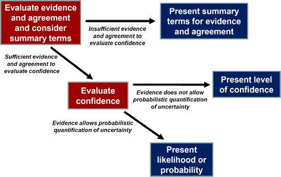
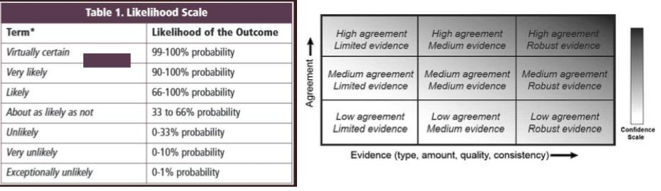
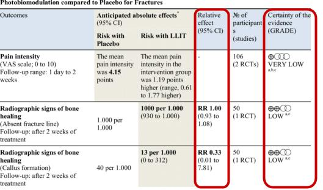
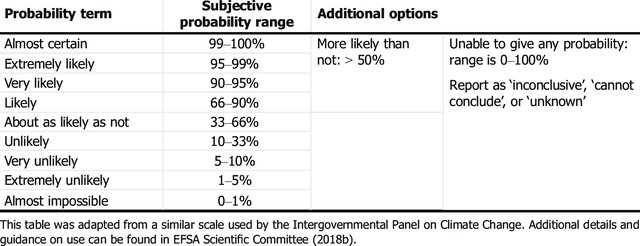

```{r, include=FALSE}
knitr::opts_chunk$set(echo = FALSE,
                      warning = FALSE,
                      tidy = FALSE,
                      message = FALSE,
                      fig.align = 'center',
                      out.width = "100%")
options(knitr.table.format = "html") 

#7.11.P-Tu195
#Session Title: 7.11.P - Late Breaking Science: Policy, Management and Communication
```

```{r, include=FALSE}
knitr::write_bib(c('posterdown', 'rmarkdown','pagedown'), 'packages.bib')
```

```{r}
#The answer to an assessment question will always be uncertain to some degree, and this uncertainty is what matters most to decision makers. We compare strategies to characterise and communicate uncertainty in conclusions developed by three organisations conducting scientific assessments: the Intergovernmental Panel of Climate Change, the Cochrane Collaboration with applications in evidence-based medicine, and the European Food Safety Authority. Their strategies differ with respect to how uncertainty in a conclusion is expressed: quantitatively, qualitatively or a mixture of both. There are commonalities in the principles and methods to identify and consider the combined impact of all relevant sources of uncertainty when characterising uncertainty in a conclusion, where differences can be due to the nature of their assessments. Uncertainty can as a concept be challenging to understand and fully embrace as part of a scientific process by experts engaging in scientific assessments and decision makers using scientific assessment as support. 
#It is important to develop strategies to communicate uncertainty in conclusions based on conceptual clarity and evidence from communication research. Acknowledge the subjective nature of uncertainty, someone is uncertain and the best we can do is to characterise it as honestly as possible. Adopt scientific approaches to use expert judgements to consider all sources of uncertainty, i.e. not only those that are addressed by the assessment model or a statistical analysis. Engage decision makers in the development of strategies to communicate uncertainty in conclusions. Find ways of expressing uncertainty are understandable and useful to them, however without compromising the need to communicate scientific uncertainty in conclusions. Evidence shows that qualitative expressions of uncertainty, such as likely or unlikely, are ambiguous and mean different things to different people. For example, this is why EFSA’s approach is to recommend that assessors always try to quantify the overall uncertainty quantitatively using probability. This should always be possible, provided the conclusion is well defined, but can be challenging for those unfamiliar to the approach. Clarify the link between specific expressions for uncertainty in a conclusion and the scientific assessment. Documenting the methods, evidence and reasoning for the assessment is essential for transparency and credibility of the conclusion. 

```

# Introduction

The answer to an assessment question will always be uncertain to some degree. Communicating this uncertainty matters to decision makers. 
Uncertainty can be challenging to understand and fully embrace as part of a scientific process by experts, as well as by decision makers using scientific assessment as support.

There are different practices for communicating uncertainty [@vanderblesCommunicatingUncertaintyFacts2019]. 
Qualitative expressions of uncertainty are ambiguous and mean different things to different people, e.g. [@efsaGuidanceCommunicationUncertainty2019]. 
A personal probability is a quantitative expression of uncertainty with a precisely defined meaning [@Ramsey_1926]. 
Reasoning with uncertainty is challenging, and making decisions with multiple forms of uncertainty increases the complexity of an already difficult task [@padillaUncertainUncertaintyHow2021].

# Aim and conclusion

Are there major differences in how three organisations conducting scientific assessments are characterising and communicating uncertainty in their conclusions? **Yes**, they differ

- in their view of when it is possible to quantify uncertainty, 

- in their use of mixtures of qualitative and quantitative expressions of uncertainty, and 

- to what extent they use one or several summaries of uncertainty in a conclusion. 

# Recommendations

-   Develop strategies to communicate uncertainty in conclusions based on conceptual clarity and evidence from communication research.

-   Acknowledge the subjective nature of uncertainty, someone is uncertain and the best we can do is to characterise it as honestly as possible.

-   Adopt scientific approaches to use expert judgements to consider all sources of uncertainty, i.e. not only those that are addressed by the assessment model or a statistical analysis. Document which sources of uncertainty have been (or not been) considered.

-   Engage decision makers in the development of strategies to communicate uncertainty in conclusions. Find ways of expressing uncertainty are understandable and useful to them, however without compromising the need to communicate scientific uncertainty in conclusions.

-   Try to express uncertainty in a conclusion quantitatively using probability. This should always be possible, provided the conclusion is well defined.

-   Clarify the link between specific expressions for uncertainty in a conclusion and the scientific assessment [@SAPEA_2019]. Documenting the methods, evidence and reasoning for the assessment is essential for transparency and credibility of the conclusion.

# Results

## The Intergovernmental Panel of Climate Change

The strength of the knowledge basis is expressed qualitatively (as *"**confidence**). **Certainty** in a conclusion is expressed quantitatively (as **likelihood** or **probability**), but only when the knowledge basis is strong enough. Verbal expressions are used to support communication of quantitative probabilities. [@mastrandreaIPCCAR5Guidance2011]

```{r, out.width="80%", fig.align='center'}
#
#Process for Evaluating and Communicating the Degree of Certainty in Key Findings. This schematic illustrates the process for evaluating and communicating the degree of certainty in key findings that is outlined in the Guidance Note for Lead Authors of the IPCC Fifth Assessment Report on Consistent Treatment of Uncertainties (Mastrandrea et al. 2010)
```

```{r, out.width="100%", fig.align='center'}


#Table 4 : Approximate probability scale recommended for harmonised use in EFSA to express uncertainty about questions or quantities of interest

#A depiction of evidence and agreement statements and their relationship to confidence. The nine possible combinations of summary terms for evidence and agreement are shown, along with their flexible relationship to confidence. In most cases, evidence is most robust when there are multiple, consistent independent lines of high-quality evidence. Confidence generally increases towards the top-right corner as suggested by the increasing strength of shading. Figure reproduced and legend adapted from Mastrandrea et al. (2010)
```


## The Cochrane Collaboration

Lines of evidence are individually evaluated by critical appraisal, over which the strength of knowledge basis is summed into a qualitative **certainty of the evidence**. If quantitative evidence synthesis is performed, uncertainty in an effect estimate is expressed quantitatively by an uncertainty interval (frequentist **confidence interval** or Bayesian **probability interval**). Conclusion is presented in a summary of findings table [@langendamAssessingPresentingSummaries2013].

```{r, out.width="60%", fig.align='center'}

```

## The European Food Safety Authority

Uncertainty in a conclusion is expressed quantitatively (as **probability**) taking into account multiple sources of evidence and sources to uncertainty [@benfordPrinciplesMethodsEFSA2018]. Verbal expressions are used to support communication of quantitative probabilities [@efsaGuidanceCommunicationUncertainty2019]. Probabilities may be communicated as **% certainty** for the more probable conclusion.  

```{r, out.width="60%", fig.align='center'}

```


# References
